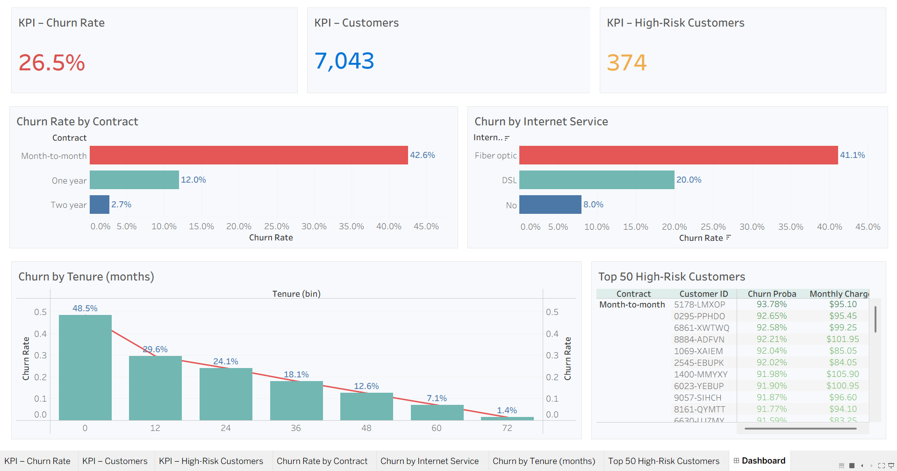

# 📉 Telco Customer Churn Analysis — Python · Scikit-learn · Tableau

---

## 1. Project Overview  

This project analyzes the **Telco Customer Churn Dataset** ([Kaggle link](https://www.kaggle.com/datasets/blastchar/telco-customer-churn)), which contains demographic, service usage, and billing details for ~7,000 telecom customers.  

The objective was to build an **end-to-end churn analysis pipeline** and an **interactive Tableau dashboard** to answer key business questions:  

- What percentage of customers are churning overall?  
- Which groups (by contract, internet type, tenure) have the highest churn?  
- Can we build a predictive model to identify **high-risk customers**?  
- How can the company use these insights to **improve retention**?  

**Workflow:**  
- **Python (Pandas, NumPy, Scikit-learn)** → data cleaning, EDA, and churn prediction pipeline (`/codes/`)  
- **Modeling** → Logistic Regression pipeline (`/models/logreg_pipeline.pkl`)  
- **Outputs** → churn predictions & feature summaries (`/outputs/`)  
- **Tableau** → interactive churn dashboard (`Telco Customer Churn.twb`)  

---

## 2. Data Structure  

The dataset includes:  

- **Demographics:** Gender, SeniorCitizen, Partner, Dependents  
- **Services:** Phone, Internet, OnlineSecurity, Contract, Payment Method  
- **Billing:** MonthlyCharges, TotalCharges, Tenure  
- **Target:** `Churn` (Yes/No)  

---

## 3. Executive Summary  

- **Overall Churn Rate:** ~26.5%  
- **High-Risk Customers (≥70% predicted probability):** ~374  
- **Customer Base:** 7,043 customers  

**Churn Breakdown:**  
- **By Contract:**  
  - Month-to-Month → 🔴 42.6% churn  
  - One Year → 12% churn  
  - Two Year → 2.7% churn  

- **By Internet Service:**  
  - Fiber Optic → 🔴 41.1% churn  
  - DSL → 20% churn  
  - No Internet → 8% churn  

- **By Tenure:**  
  - Customers with <12 months tenure are most at risk (churn ~48%).  
  - Longer tenure customers are significantly more loyal (<2% churn after 5+ years).  

---

## 4. Dashboard Preview  

  

**Key Features:**  
- KPI cards for **Churn Rate, Total Customers, High-Risk Customers**  
- Bar charts: **Churn by Contract & Internet Service**  
- Line/Bar combo: **Churn by Tenure Buckets**  
- Table: **Top 50 High-Risk Customers** with churn probability & monthly charges  

---

## 5. Insights  

### Key Risk Drivers  
- **Month-to-Month contracts** and **Fiber Optic internet** customers churn the most.  
- New customers (tenure < 1 year) are significantly more likely to leave.  
- Customers with higher monthly charges show higher churn probability.  

### Model Insights  
- Logistic Regression pipeline achieved good interpretability.  
- Predicted churn probabilities allow ranking customers by risk.  

---

## 6. Recommendations  

1. **Promote Long-Term Contracts** → Incentivize yearly/2-year plans to reduce churn risk.  
2. **Target Fiber Optic Users** → Improve service quality/support for fiber customers.  
3. **Onboarding Programs** → Focus on first-year customers with welcome offers & retention campaigns.  
4. **Price Sensitivity** → Monitor high monthly charge customers and offer tailored discounts or bundles.  
5. **Retention Alerts** → Use churn probability scores to prioritize at-risk customers in CRM systems.  

می‌خوای برات یک نسخه‌ی خیلی خلاصه‌تر هم بنویسم (مثل executive summary برای رزومه/لینکدین) یا همین کامل رو می‌خوای فقط تو گیت بذاری؟
